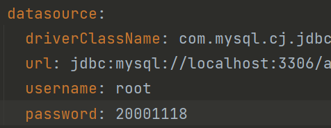
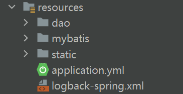
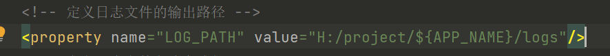
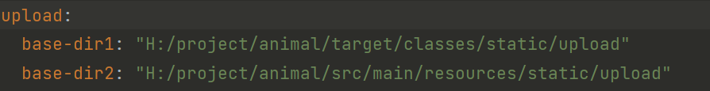

# StrayAnimalRescuePlatformManagementSystem

<h1 align="center">流浪动物救助平台管理系统</h1>

	
    
    
    

## 简介

>访问路径
> 前台 ： http://localhost:8080/animal/front/index.html 
> >帐密 : 001 001 
> 
> 后台 ： http://localhost:8080/animal/admin/dist/index.html#/index 
> >账密 : hzc hzc123
>

## 环境

- <b>IntelliJ IDEA</b>

- <b>Mysql 8.0.30</b>

- <b>Tomcat 9.0.29</b>

- <b>JDK 1.8</b>

## 配置修改

> pom.xml修改成自己的mysql数据库版本
> 

> applicaton.yml修改数据库密码
#

>logback-spring.xml文件修改日志位置 
> 
> applicaton.yml修改下载路径
> 
>>都是将H:/project 修改成自己的
 

